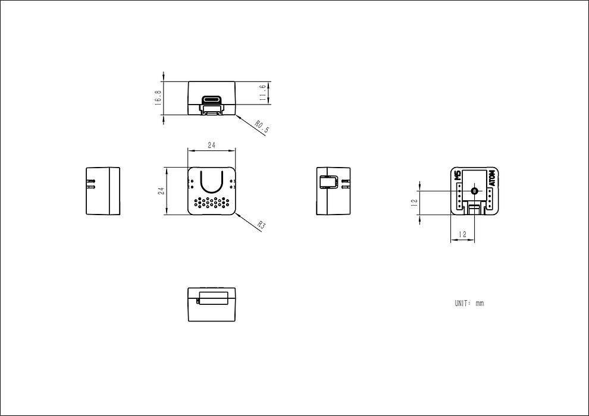

# Atom VoiceS3R


Atom VoiceS3R と OpenAI Realtime API を使う音声チャットボットの開発用プロジェクトです。
Arduino の操作には Nix / direnv / just を使います。機器の基本動作と音声テストは
[firmware/README.md](firmware/README.md) を参照してください。

## ディレクトリと Web 開発

- `web/`: Next.js アプリ、設定、テスト。API は `web/app/api/realtime/token/route.ts`。
- `firmware/`: Arduino ファームウェアと機器操作ツール。
- `infra/`: Vercel の Terraform 定義。
- `nix/`: 共通の開発環境と pre-commit 設定。

pnpm workspace と lockfile はリポジトリルートで管理します。以下もルートで実行します。

```sh
pnpm install --frozen-lockfile
pnpm dev
pnpm test
pnpm typecheck
pnpm build
```

Web 用パッケージの追加は `pnpm --dir web add <package>` を使います。
SOPS の `.enc.env` は引き続きリポジトリルートで管理します。

## Realtime のボタン録音・音声応答

前面ボタンを押している間に質問を録音・送信し、離すと入力を確定して回答を生成します。
接続は設定時に済ませて維持し、同じセッション内では会話履歴を引き継ぎます。
回答音声は約240 ms分を受信したところから再生します。録音と再生を切り替える半二重方式で、
応答中の割り込みは受け付けません。

```text
本体 ─ HTTPS + DEVICE_TOKEN → Vercel /api/realtime/token
                                      └ OpenAI の短命トークンを発行
本体 ─ WSS + 短命トークン → OpenAI Realtime API
```

### 1. デバイス認証情報

`.enc.env` に `OPENAI_API_KEY`、`SSID`、`PASS` を SOPS で保存し、次を実行します。

```sh
just realtime-init
```

`DEVICE_TOKEN` を生成して `.enc.env` に暗号化保存します。既存の値は変更しません。
値はログやコマンド引数に出しません。

### 2. Vercel の設定

Vercel プロジェクト、環境変数、発行制限は [Terraform](infra/README.md) で管理します。
既存の Next.js プロジェクトと2つの環境変数を取り込み、アプリのデプロイは Git 連携を使います。
Vercel の Root Directory は Terraform で `web`、Functions の既定リージョンは東京 `hnd1` に設定します。
リージョン変更は次の Git 連携デプロイから有効になります。東京への変更が関係するのは
初回接続・再接続のトークン発行で、音声通信は本体から OpenAI に直接接続します。
`.enc.env` の `VERCEL_API_TOKEN` で操作し、OpenAI キーとデバイストークンも SOPS から渡します。

```sh
just infra-init
just infra-check
just infra-plan
just infra-apply
```

`infra-apply` は直前の plan を適用します。通常の変更では plan の差分を先に確認してください。
発行制限は `infra/main.tf` に定義しています。

- 条件: `@vercel/firewall` の `realtime-token`
- 発行頻度: 60秒あたり6回
- 上限超過時: HTTP 429

`OPENAI_API_KEY` と `DEVICE_TOKEN` は既存の Production / Preview への登録を保持しています。
`SSID`、`PASS`、`VERCEL_API_TOKEN` は Vercel の環境変数には登録しません。

SDK で認証済みデバイスごとに制限します。ルールがない・確認できない場合は API が503を返し、
トークンを発行しません。ローカルの `next dev` や Preview でも発行せず503にします。
Firewall のカウンターはリージョン単位です。OpenAI の料金上限を保証する仕組みではありません。

本体からログイン画面なしでアクセスできる Production URL を使います。Deployment Protection が
有効な Preview URL は、このテストでは使いません。環境変数を変更したら再デプロイしてください。

### 3. 本体へ設定・実行

デプロイ先が確定したら、SOPS で `.enc.env` に次を追加します。

```dotenv
REALTIME_TOKEN_URL=https://your-project.vercel.app/api/realtime/token
```

```sh
# monitor を終了してから実行
just realtime-upload /dev/cu.usbmodem1101
just realtime-connect /dev/cu.usbmodem1101
just monitor /dev/cu.usbmodem1101
```

`MIC_WARMING` の間はボタンを離し、`REALTIME_READY` の後に前面ボタンを押しながら話します。
押している間の音声を送信し、離すと AI が短い日本語で返答します。**回答生成には API 利用料金が発生します。**
失敗時の自動再送はしません。接続時に `TOKEN_HTTP 200`、`WS_HTTP 101`、`OK SESSION` が出ます。
接続を維持している間は、次の質問でトークンを取得し直しません。

1往復のログ例（時間・トークン数・金額は実測値が入ります）:

```text
RECORDING
BUTTON_RELEASED
RECORDED_MS ...
REQUESTING
RELEASE_TO_COMMIT_MS ...
OK INPUT_AUDIO
RELEASE_TO_FIRST_AUDIO_MS ...
RELEASE_TO_PLAYBACK_MS ...
PLAYING
USAGE input=... output=... text_in=... audio_in=... cached_text=... cached_audio=... text_out=... audio_out=...
ESTIMATED_USD ... pricing=2026-09-24
RESPONSE_DONE_MS ...
PLAYBACK_UNDERRUNS 0
REALTIME_TURN_DONE
MIC_WARMING
REALTIME_READY
```

短い応答では `PLAYING` より前に `RESPONSE_DONE_MS` が出ることもあります。
`TOKEN_MS`、`WS_CONNECT_MS`、`SESSION_READY_MS` は接続時の各段階にかかった時間です。
`RELEASE_TO_*` はボタン解放から入力確定の送信・最初の音声受信・再生開始までの時間です。
再生開始後には語頭欠け防止の200 msの無音とハードウェアのバッファ分があります。
`PLAYBACK_UNDERRUNS` が増える場合は、再生キューへの供給が追いついていません。

`USAGE` は `response.done` の実測トークン数です。`ESTIMATED_USD` は2026-09-24確認の
`gpt-realtime-2.1` 公開単価で計算した OpenAI の概算額（USD）で、税・為替・Vercel料金は含みません。
キャッシュ済み入力を二重計上せず、前の会話が入力に含まれる場合はそれも計算します。
モデルや内訳が想定と異なる場合は推測せず `unavailable` と表示します。未取得のトークン値は `-1` です。
接続障害で最終イベントが届かなかった場合にも料金が発生し得るため、請求額は OpenAI の Usage で確認してください。

待機中の `p` + Enter は固定テキストの再生テスト（完了ログは `REALTIME_TEST_DONE`）です。
`r` + Enter はセッションを作り直して会話履歴をリセットします。Wi-Fiの再設定は不要です。
`RECONNECT_REQUIRED` が出た場合も `r` を使います。Wi-Fiが切れている場合は、接続先を確認して
`realtime-connect` を再実行してください。API の60分上限に余裕を持ち、55分経過後の待機時に接続を閉じます。
再接続ではトークンを取得するため、短時間の連打は発行制限（60秒あたり6回）にかかります。

- 接続情報は USB から RAM に渡します。再起動後は `realtime-connect` を再実行します。
- 通常の OpenAI API キーは本体に送りません。短命トークンは接続時だけ取得します。
- 録音は24 kHz / mono / signed PCM16 little-endian、最大10秒（480,000バイト）。
  150 ms未満の押下は送信せず破棄します。150 msに満たない録音でも回答は生成しません。
  10秒で録音を止めて `RECORDING_LIMIT RELEASE_BUTTON` を表示します。音声は送信済みでも、
  ボタンを離すまでは入力を確定せず、回答を生成しません。
- マイク開始後は約1.2秒ウォームアップします。待機中の音は20 msの一時バッファに取得して
  破棄し、送信・保存しません。録音開始には通常最大約20 ms、解放後の取り込み終了には
  最大約40 msとループ処理分の遅延があります。実際の語頭・語尾は実機で確認します。
- ネットワーク用の FreeRTOS タスクが録音済み部分だけを最大100 msのチャンクで送信します。
  メインループはボタンを監視し、M5 の録音・再生キューを処理します。
  VAD は無効で、解放後の `input_audio_buffer.commit` 確定通知を受けて `response.create` を送ります。
- 録音と回答は PSRAM に保持し、ターン終了・失敗時に読み書きが止まってから消去します。
  Flash や Mac のファイルには保存しません。送信・再生中のバッファは消去・再利用しません。
- 会話履歴はサーバー側の同じセッション内に残ります。指示以外の履歴を8,000入力トークンに制限し、
  上限到達時は古い履歴を削って80%に減らします。再接続・再起動時は履歴を引き継ぎません。
- 既存録音テストの DMA・ES8311・ゲイン設定を引き継いでいます。録音ノイズの調整は含みません。
- HTTPS / WSS ともにボードパッケージの CA バンドルで証明書・ホスト名を検証します。
- 短命トークンの接続開始期限は60秒です。期限は接続済みセッションの終了期限ではなく、
  期限内には複数セッションを作成できます。セッション設定もクライアントが変更可能です。
- モデルは `gpt-realtime-2.1`、声は `marin`、出力は256トークンを上限に要求します。
  本体は最大20秒の回答音声・128 KiBのイベントを受け付けます。回答の前後に200 msの無音を付けます。
  ストリーミング再生なので、上限超過・不完全な応答が判明する前に一部が聞こえる場合があります。
  エラー時は再生を止めて接続を閉じ、不完全な履歴を次の質問に使いません。
- WebSocket は同梱 ESP-IDF の TCP transport を使います。追加の Arduino ライブラリは不要です。

`TOKEN_HTTP 401` はデバイス認証の不一致、429は発行頻度超過、503はサーバー設定・Firewallを確認します。
502は OpenAI 側の発行失敗または不正な応答です。`WS_HTTP` が101以外なら WebSocket 接続に失敗しています。
応答本文・認証ヘッダー・音声の文字起こしはログに表示しません。

`FAIL MIC_INIT` / `MIC_FORMAT` / `MIC_CAPTURE` / `MIC_TIMEOUT` は録音側の異常です。
`FAIL AUDIO_SEND_TIMEOUT` / `WS_SEND` は送信失敗、`FAIL REALTIME_API` は API のエラーです。
復旧には `r` を使い、改善しない場合は本体を再起動して `realtime-connect` をやり直してください。

実機では、短い質問を2回以上続けて、2回目にはトークン取得・WebSocket接続が発生しないこと、
前の会話を参照できること、短押しで回答を生成しないこと、10秒上限でボタンを離すまで
回答を生成しないこと、応答中に押し続けても次の録音が始まらないことを確認します。
音の途切れ・語頭や語尾の欠け、および `RELEASE_TO_PLAYBACK_MS` も確認してください。

### 検証

```sh
pnpm test
pnpm typecheck
pnpm build
python3 -m unittest discover -s firmware -p 'test_*.py'
just realtime-build
```

Python テストには `clang++` で実際のスケッチの状態遷移をコンパイルするテストも含みます。
録音完了前の送信防止、短押し・10秒上限、ストリーミング再生、バッファの寿命、セッション再利用、
ネットワークの失敗・タイムアウト、キャッシュを含む料金計算を検証します。`clang++` がない環境ではこのテストはスキップされます。
単体テストは OpenAI API を呼びません。本番の発行制限は `just infra-verify-limit`、
トークン発行の疎通は `just infra-verify` で検証します。実機での音声受信は別途確認します。

### 公式資料

- [OpenAI Realtime WebSocket](https://developers.openai.com/api/docs/guides/voice-websockets?api=realtime)
- [OpenAI client secrets](https://developers.openai.com/api/reference/resources/realtime/subresources/client_secrets/methods/create)
- [OpenAI Realtime conversations](https://developers.openai.com/api/docs/guides/realtime-conversations)
- [OpenAI Realtime push-to-talk](https://developers.openai.com/api/docs/guides/realtime-conversations#push-to-talk)
- [M5Stack VoiceS3R マイク](https://docs.m5stack.com/en/arduino/atom_echos3r/mic)
- [Vercel Rate Limiting SDK](https://vercel.com/docs/vercel-firewall/vercel-waf/rate-limiting-sdk)
- [Vercel System environment variables](https://vercel.com/docs/environment-variables/system-environment-variables)

- [OpenAI Realtime の料金と履歴](https://developers.openai.com/api/docs/guides/realtime-costs)
- [OpenAI API pricing](https://developers.openai.com/api/docs/pricing)
- [Vercel Functions のリージョン](https://vercel.com/docs/functions/configuring-functions/region)
